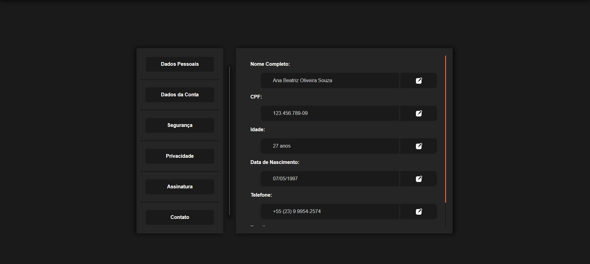
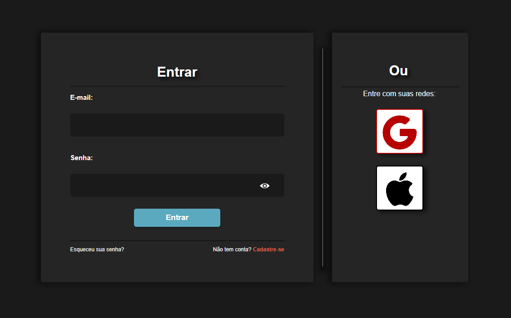
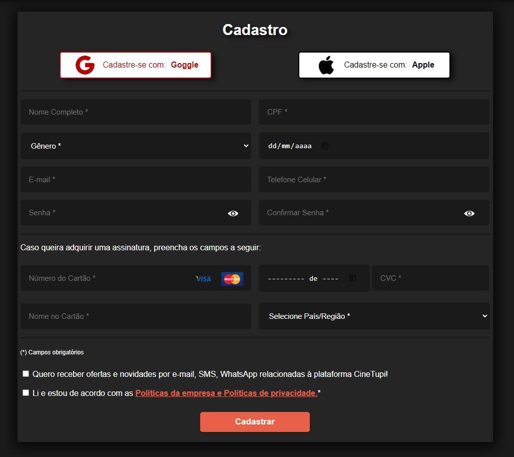

# Atividade Prática Supervisionada nº 1

## Objetivos da atividade

- Consolidar os conhecimentos em HTML e CSS.
- Desenvolver a lógica de estruturação e estilização de páginas web.
- Estimular a criatividade e a resolução de problemas.

## Requisitos

Estrutura clara e organizada, com:
- Cabeçalho. 
- Rodapé.
- Área de conteúdo.
- 6 páginas de conteúdo.
- Elementos como títulos, parágrafos, listas, links e formulários.
- Flexbox

## Recursos 

- HTML
- CSS

## Screenshots 

